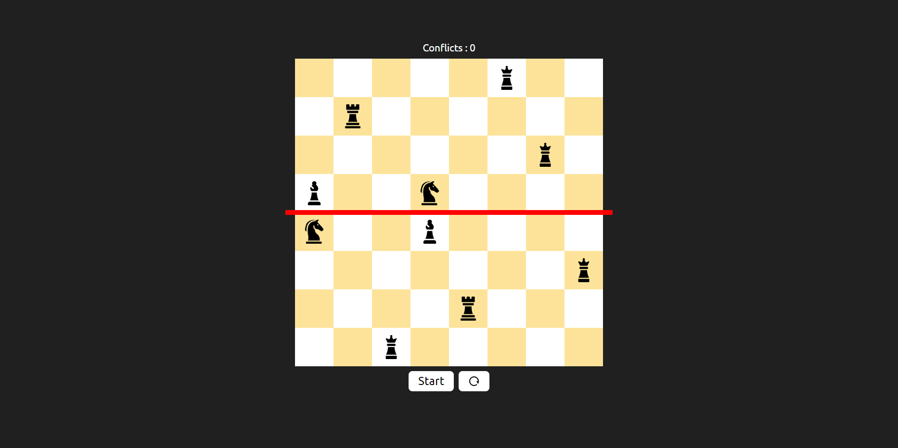

# Genetic Algorithm for Placing 10 Chess Pieces on an 8x8 Board with Minimum Conflicts

This repository contains a genetic algorithm designed to place 10 chess pieces [ 4 queens , 2 rocks , 2 knights , 2 bishops ] on an 8x8 board with the goal of minimizing conflicts between the pieces.

try it here : https://maze-3lll.vercel.app

## Features

- **Algorithm Implementation**: Core logic of the genetic algorithm.
- **Fitness Evaluation**: Methods to assess the number of conflicts in a given arrangement.
- **Selection, Crossover, and Mutation Functions**: Evolutionary operations used to generate new populations.

This project showcases the application of genetic algorithms to a classic optimization problem in a simple and comprehensible manner.

## Optimal Solution

Below is an image of one of the best optimal solutions found by the algorithm:

## Usage

1. **Setup**: Install the required dependencies ( `npm i` ).
2. **Run the Script**: Execute the script to solve the maze and visualize the solution ( `npx vite --port=4000` ) [or any port you want].
3. **Use it in browser**: localhost:4000 [or your early setted port].
